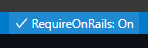
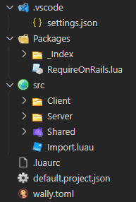

# RequireOnRails

An opinionated Roblox Luau utility extension that simplifies working with complex codebase hierarchies by automatically generating file aliases and managing import statements. It works in conjunction with Luau LSP and a custom requirer module in order to parse the non-standard string paths.

RequireOnRails does *not* prevent you from utilizing any default require behaviors. If the Luau module detects a non aliased path it will fall back to the default Roblox require behavior.

## Features

### Automatic File Alias Generation
RequireOnRails scans your workspace directories and automatically generates aliases in your `.luaurc` file, allowing you to import modules by their basename instead of complex relative paths.

**Before:**
```lua
local MyModule = require(script.Parent.Parent.Shared.Utils.MyModule)
```

**After:**
```lua
local MyModule = require("@MyModule")
```

<details>
<summary>More Features:</summary>

### Import Line Management
The extension automatically hides or reduces the opacity of boilerplate import lines in your Luau files, keeping your editor clean while maintaining functionality.

### Smart Directory Scanning
- Scans specified directories for `.lua` and `.luau` files
- Handles `init.lua` files by aliasing the containing folder name
- Resolves naming conflicts by preferring unique basenames
- Ignores specified directories (like directories starting with `_` for private modules)

### Require Statement Updates
- Automatically detects file renames and moves
- Prompts to update basename require statements when files are renamed
- Handles absolute path updates when files are moved between alias directories
- Configurable collision detection with automatic duplicate file renaming

### Import Management Enhancements
- Automatic import require definition detection and insertion
- Multiple placement options for import statements (top of file, before first require, after services)
- Optional Selene comment support for import lines
- Centralized import validation logic

### Status Bar Integration
Toggle the extension on/off with a convenient status bar button showing the current state.



</details>

## Requirements
- Visual Studio Code
- Luau LSP VSCode extension (or some other form of Roblox Luau language support)
- RequireOnRails Luau module
- A project structure with unique file basenames (no duplicate names across scanned directories)
  
### Default Expected Project Structure
For the default configuration settings, RequireOnRails expects the following project structure:

```
your-project/
├── .vscode/
│   └── settings.json
├── Packages/             # Wally Packages
│   └── RequireOnRails.lua
├── src/
│   ├── Import.luau       # Import module tailored to your project
│   ├── Server/           # Server-side code (@Server alias)
│   ├── Client/           # Client-side code (@Client alias)
│   └── Shared/           # Shared code (@Shared alias)
├── .luaurc               # Generated/maintained by extension
├── default.project.json
└── wally.toml
```
Your project will likely look something like this:



If your project structure does not follow this exactly then you can configure the extension settings to match your project as needed.

## Quick Start

### Option 1: Use Template
1. Open a fresh workspace in VS Code
2. Open Command Palette (`Ctrl+Shift+P`)
3. Run `Setup Default Project Structure`
4. Activate RequireOnRails using the status bar button
5. Start coding with `require("@ModuleName")` syntax!

### Option 2: Manual Setup
1. Create your project structure manually
2. Configure `directoriesToScan`, `manualAliases`, and `importModulePaths` in VS Code settings to match your project
3. Get the RequireOnRails Luau module (You can use the `downloadLuauModule` command) and set up your import system
4. Activate RequireOnRails using the status bar button

## Setup Guide

### 1. Configuration
Adjust these key settings to match your project structure in your VS Code settings (`.vscode/settings.json`):
```jsonc
{
    // These are the directories that RoR will scan through to make aliases.
    "require-on-rails.directoriesToScan": [
        "src/Server",
        "src/Client", 
        "src/Shared"
    ],

    // Manual aliases for absolute path support. Maps alias names to directory
    // paths. These should typically be a superset of your directoriesToScan.
    "require-on-rails.manualAliases": {
        "Server": "src/Server",
        "Client": "src/Client",
        "Shared": "src/Shared"
    },

    // This is the path to the importer you generate via the RequireOnRails 
    // luau module. This path should be in Roblox hierarchy terms.
    "require-on-rails.importModulePaths": [
        "ReplicatedStorage.src.Import", // Default expected path
        "game:GetService(\"ReplicatedStorage\").src.Import", // Potential alternate path
        "game.ReplicatedStorage.src.Import" // Potential alternate path
    ],
}
```

### 2. Project Structure
Ensure your project follows a structure where:
- Files have unique basenames across all scanned directories
- Directory structure matches your `.vscode/settings.json` configuration
- Import system is properly configured

### 3. Import System Setup
1. Get the RequireOnRails Luau module via Wally or the `downloadLuauModule` command.
2. Create an `Import.luau` module by following the instructions in the module. (Example below)
3. Ensure your `importModulePaths` configuration points to your newly setup `Import` module
4. Add the require override line to your files:
   
```lua
-- This line may vary depending on your `importModulePaths` configuration
require = require(ReplicatedStorage.src.Import)(script)
```
<details>
<summary>`Import.luau` Module Example</summary>

```lua
--// Services //--
local RunService = game:GetService("RunService")
local ReplicatedStorage = game:GetService("ReplicatedStorage")

local RequireOnRails = require(ReplicatedStorage.src.Packages.RequireOnRails)
local ImportGenerator: RequireOnRails.ContextualImportGenerator

------------------------------

-- Defines whether or not an instance should be ignored by the import generator.
local ignorePredicate = function(instance: Instance): boolean
	local isDescendantOfPackageIndexFolder = instance:IsDescendantOf(ReplicatedStorage.src.Packages._Index)
	local shouldIgnoreFile = isDescendantOfPackageIndexFolder
	return shouldIgnoreFile
end

------------------------------

if RunService:IsClient() then
	ImportGenerator = RequireOnRails.create {
		Ancestors = {
			["Client"] = ReplicatedStorage.src.Client,
			["Shared"] = ReplicatedStorage.src.Shared,
			["Packages"] = ReplicatedStorage.src.Packages,
		},
		IgnorePredicate = ignorePredicate,
	}
else
	local ServerScriptService = game:GetService("ServerScriptService")
	ImportGenerator = RequireOnRails.create {
		Ancestors = {
			["Server"] = ServerScriptService.src.Server,
			["Shared"] = ReplicatedStorage.src.Shared,
			["Packages"] = ReplicatedStorage.src.Packages,
			["ServerPackages"] = ServerScriptService.src.ServerPackages,
		},
		IgnorePredicate = ignorePredicate,
	}
end

return ImportGenerator
```
</details>

## Usage

1. **File Organization**: Organize your Luau files in the directories specified in `directoriesToScan`. Ensure your `Import` module file is setup.

2. **Activation**: Click the status bar button to toggle RequireOnRails on/off

3. **Automatic Aliases**: The extension will automatically generate aliases in your `.luaurc` file based on file basenames

4. **Import Management**: The extension can automatically prompt to add missing import require definitions when it detects `@` require statements

5. **File Operations**: When you rename or move files, the extension will detect the operation and prompt to update require statements accordingly

## Important Notes

⚠️ **Unique Basenames Required**: All files in scanned directories must have unique basenames. If you have `PlayerService.luau` in both Server and Client directories, no alias will be generated to avoid ambiguity.

⚠️ **Configuration Required**: You must configure `directoriesToScan` and `importModulePaths` to match your specific project structure.

⚠️ **RequireOnRails Module**: This extension requires a separate Luau module to function. The module is available via Wally.

⚠️ **Import override**: Properly override the require in each script. ex: `require = require(path.to.Import)(script)`. *(Do not localize! Doing so will break LuauLSP)*

## Extension Settings and Commands
<details>
<summary> Show Settings & Commands </summary>

This extension contributes the following settings through `require-on-rails.*`:

### Core Settings

* `require-on-rails.startsImmediately`: 
  - **Type**: `boolean`
  - **Default**: `false`
  - **Description**: Whether to start the extension automatically when VS Code finishes loading

### Import Management

* `require-on-rails.importModulePaths`: 
  - **Type**: `array<string>`
  - **Default**: 
    - `"game.ReplicatedStorage.src.Import"`
    - `"ReplicatedStorage.src.Import"`
    - `"game:GetService(\"ReplicatedStorage\").src.Import"`
    - `"game:GetService(\"ReplicatedStorage\"):FindFirstChild(\"Import\", true)"`
    - `"ReplicatedStorage:FindFirstChild(\"Import\", true)"`
  - **Description**: Valid import module paths for the require override. Uses the first value as default when adding import statements. 
  - ***⚠️ Modify this to match your project structure!***

* `require-on-rails.tryToAddImportRequire`: 
  - **Type**: `boolean`
  - **Default**: `true`
  - **Description**: Automatically prompt to add the import require definition when opening files that have `@` require statements but are missing the import definition

* `require-on-rails.importOpacity`: 
  - **Type**: `number`
  - **Default**: `0.45`
  - **Description**: Opacity level (0.0-1.0) for import require override lines in the editor. Lower values make lines more transparent

* `require-on-rails.preferredImportPlacement`: 
  - **Type**: `string`
  - **Default**: `"TopOfFile"`
  - **Enum**: `["TopOfFile", "BeforeFirstRequire", "AfterDefiningRobloxServices"]`
  - **Description**: Controls where the import require definition is placed when automatically added to files
    - `TopOfFile`: Place import at the very top of the file
    - `BeforeFirstRequire`: Place import before the first require statement  
    - `AfterDefiningRobloxServices`: Place import after Roblox service definitions (game:GetService calls)

* `require-on-rails.addSeleneCommentToImport`: 
  - **Type**: `boolean`
  - **Default**: `false`
  - **Description**: Whether to add a Selene comment to disable warnings for the import require definition line

### File Operation Settings

* `require-on-rails.enableBasenameUpdates`: 
  - **Type**: `boolean`
  - **Default**: `true`
  - **Description**: Whether to prompt for updating basename require statements when files are renamed

* `require-on-rails.enableAbsolutePathUpdates`: 
  - **Type**: `boolean`
  - **Default**: `false`
  - **Description**: Whether to prompt for updating absolute require paths when files are moved between different alias directories

* `require-on-rails.enableFileNameCollisionResolution`: 
  - **Type**: `boolean`
  - **Default**: `false`
  - **Description**: Whether to detect and handle filename collisions by automatically renaming files with '_Duplicate' suffix

### Directory Configuration

* `require-on-rails.directoriesToScan`: 
  - **Type**: `array<string>`
  - **Default**: `["src/Server", "src/Client", "src/Shared"]`
  - **Description**: List of directories to scan for generating file aliases (relative to workspace root) 
  - ***⚠️ Modify this to match your project structure!***

* `require-on-rails.ignoreDirectories`: 
  - **Type**: `array<string>`
  - **Default**: `["^_.*"]`
  - **Description**: Regex patterns for directories/files to ignore when scanning. By default ignores anything prefixed with underscore. Useful for ignoring things like the `_Index` folder for Wally packages.

* `require-on-rails.manualAliases`: 
  - **Type**: `object`
  - **Default**: `{"Server": "src/Server", "Client": "src/Client", "Shared": "src/Shared"}`
  - **Description**: Manual aliases for absolute path support. Maps alias names to their corresponding directory paths (relative to workspace root). Used for absolute require path updates when files are moved between different alias directories.

## Commands

RequireOnRails provides the following commands accessible via Command Palette (`Ctrl+Shift+P`):

* **Toggle RoR Active**: Enable or disable RequireOnRails functionality
* **Setup Default Project Structure**: Setup a project structure ready out of the box for RequireOnRails
* **Download Luau Module**: Download the RequireOnRails Luau module via Wally package manager or as a raw Luau file
* **Add Import require def to all Luau files**: Automatically add import require definitions to all files that need them
* **Regenerate Aliases (Debug)**: Force regeneration of all aliases (useful for troubleshooting)

</details>

## Troubleshooting

### Common Issues

**Q: My aliases aren't generating**
- Check that `directoriesToScan` matches your actual directory structure
- Ensure file basenames are unique across all scanned directories
- Verify RequireOnRails is activated (check status bar)

**Q: Import require prompts not working**
- Verify `importModulePaths` points to your actual import module location
- Check that files contain `require("@SomeName")` statements
- Ensure `tryToAddImportRequire` is enabled in settings

**Q: File rename updates not working**
- Check that the relevant enable settings are turned on (`enableBasenameUpdates`, etc.)
- Verify the extension is activated and monitoring file changes
- Ensure file basenames are unique across all scanned directories

**Q: Import statements not being added correctly**
- Check your `preferredImportPlacement` setting
- Verify that the import module path in `importModulePaths` is correct
- Ensure the target files contain `@` require statements

**Q: Selene comments not appearing**
- Make sure `addSeleneCommentToImport` is set to `true`
- Verify that a `selene.toml` file exists in your workspace root
- Check that the import statement is being added successfully first
