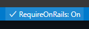
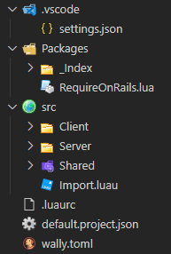

# RequireOnRails

[](https://github.com/Raild3x/require-on-rails/actions/workflows/ci.yml)
[](https://wally.run/package/raild3x/requireonrails)
[](LICENSE.md)

An opinionated Roblox Luau utility extension that simplifies working with complex codebase hierarchies. It manages your require paths in one of two ways: by **generating `.luaurc` aliases** so modules can be required by basename and resolved at runtime, or by **writing full, statically-resolvable paths** into your source as you type.

RequireOnRails does *not* prevent you from utilizing any default require behaviors. If a path is not one it manages, it falls back to the default Roblox require behavior.

**[Choosing a Mode](#choosing-a-mode)** · **[Features](#features)** · **[Requirements](#requirements)** · **[Setup and Usage](#setup-and-usage)** · **[Settings and Commands](#extension-settings-and-commands)** · **[CI](#continuous-integration)** · **[Troubleshooting](#troubleshooting)**

## Choosing a Mode

RequireOnRails runs in one of two modes per workspace. You are asked which on first activation, and you can switch any time with **RequireOnRails: Select Mode**.

| | **Dynamic** *(default)* | **Explicit** |
|---|---|---|
| You type | `require("@MyModule")` | `require("@MyModule")` |
| What ends up in your source | `require("@MyModule")` | `require("@Shared/Stuff/MyModule")` |
| Resolved | at runtime, by the Luau module | at edit time, by the extension |
| `.luaurc` | generated for you | **yours** — the extension only reads it |
| Luau runtime module | required | only for the `alias` path style |
| `require = Import(script)` boilerplate | required in every file | not used, except with the `alias` style |
| Duplicate basenames | ambiguous — no alias is generated | fine — completion lists every candidate |
| Moving a file | requires keep working untouched | you are prompted to rewrite the paths |
| Best for | the shortest possible require lines | no runtime dependency, greppable paths |

In **explicit** mode the `explicitPathStyle` setting decides the form written into your files:

- **`alias`** (default) — `@Shared/Stuff/MyModule`, built from the longest matching alias in your `.luaurc`. Still needs the Luau runtime module, because Roblox does not support `.luaurc` aliases natively.
- **`relative`** — `./Stuff/MyModule`. Resolved natively by Roblox; no runtime dependency.
- **`game`** — `@game/ReplicatedStorage/src/Shared/Stuff/MyModule`. Resolved natively by Roblox, mapped through your Rojo project file.

Enable `preferRelativePaths` to write the relative form whenever it is strictly shorter than the styled form.

## Features

### What both modes do

- **Smart directory scanning** — scans the directories you configure for `.lua`/`.luau` files, treats `init.lua`/`init.luau` as the containing folder, and skips directories matching `ignoreDirectories` (by default anything prefixed with `_`, such as Wally's `_Index`).
- **Rename and move detection** — notices when files move and offers to update the requires that pointed at them.
- **Problems-panel diagnostics** — requires that cannot resolve are reported with the reason.
- **Status bar integration** — toggle the extension on and off, and open the menu, from the status bar.



### Dynamic mode

**Automatic file alias generation.** Aliases are written into your `.luaurc` from file basenames, so you can require a module by name instead of by path.

**Before:**
```lua
local MyModule = require(script.Parent.Parent.Shared.Utils.MyModule)
```

**After:**
```lua
local MyModule = require("@MyModule")
```

- **Import line management** — the boilerplate import lines are dimmed in the editor, keeping your files readable while staying functional. Both single-line and multiline forms are recognised, including type annotations and comments.
- **Import insertion** — missing import require definitions are detected and can be inserted automatically, with a configurable template and placement.
- **Ambiguity handling** — duplicate basenames are reported rather than silently guessed, and `pathPriority` can pick a winner.

### Explicit mode

- **Completion** — typing `require("@MyMo` lists every matching module, nearest to the editing file first, with the full path it will insert shown greyed-out on each row so you can tell same-named modules apart without selecting them.
- **Auto-replace** — finish typing `require("@MyModule")` without picking a suggestion and the name is rewritten to the closest match's full path when your cursor leaves the string. Saving sweeps anything missed.
- **Full-resolution diagnostics** — every require string is resolved against the filesystem, so a path broken by a move is flagged instead of failing at runtime.
- **Move handling** — requires elsewhere that point at a moved file are updated after you confirm; relative requires *inside* a moved file are fixed automatically.
- **Bulk restyle** — **Rewrite All Requires to Current Style** re-renders every resolvable require, which is also how you migrate a codebase from dynamic mode.

## Requirements

- Visual Studio Code
- Luau LSP VSCode extension (or some other form of Roblox Luau language support)
- **The RequireOnRails Luau module** — required in dynamic mode, and in explicit mode only when using the `alias` path style. The `relative` and `game` styles need no runtime dependency.
- **A Rojo project file** — only for explicit mode's `game` path style, to map files to DataModel paths.
- **Unique file basenames** across scanned directories — required in dynamic mode. Explicit mode handles duplicates fine.

### Default Expected Project Structure
For the default configuration settings, RequireOnRails expects the following project structure:

```
your-project/
├── .vscode/
│   └── settings.json
├── Packages/             # Wally Packages
│   └── RequireOnRails.lua
├── src/
│   ├── Import.luau       # Import module tailored to your project
│   ├── Server/           # Server-side code (@Server alias)
│   ├── Client/           # Client-side code (@Client alias)
│   └── Shared/           # Shared code (@Shared alias)
├── .luaurc               # Generated in dynamic mode; yours in explicit mode
├── default.project.json
└── wally.toml
```
Your project will likely look something like this:



If your project structure does not follow this exactly then you can configure the extension settings to match your project as needed.

## Setup and Usage

Whichever mode you use, start here:

1. Install the extension and open your project folder.
2. Set `require-on-rails.directoriesToScan` to the directories holding your modules (see [Settings](#extension-settings-and-commands)).
3. Pick a mode when prompted on first activation, or run **RequireOnRails: Select Mode**.
4. Activate RequireOnRails with the status bar button.

Then open the guide for your mode below.

<details>
<summary><b>▶ Dynamic Mode — setup and daily use</b></summary>

### Quick start

**Option 1: Use the template**
1. Open a fresh workspace in VS Code
2. Open Command Palette (`Ctrl+Shift+P`)
3. Run `RequireOnRails: Setup Default Project Structure`
4. Activate RequireOnRails using the status bar button
5. Start coding with `require("@ModuleName")` syntax!

**Option 2: Manual setup**
1. Create your project structure manually
2. Configure `directoriesToScan`, `manualAliases`, and `importModulePaths` in VS Code settings to match your project
3. Get the RequireOnRails Luau module (You can use the `downloadLuauModule` command) and set up your import system
4. Activate RequireOnRails using the status bar button

### 1. Configuration
Adjust these key settings to match your project structure in your VS Code settings (`.vscode/settings.json`):
```jsonc
{
    // These are the directories that RoR will scan through to make aliases.
    "require-on-rails.directoriesToScan": [
        "src/Server",
        "src/Client", 
        "src/Shared"
    ],

    // Manual aliases for absolute path support. Maps alias names to directory
    // paths. These should typically be a superset of your directoriesToScan.
    "require-on-rails.manualAliases": {
        "Server": "src/Server",
        "Client": "src/Client",
        "Shared": "src/Shared"
    },

    // Ordered path prefixes used to resolve ambiguous basename aliases.
    // Earlier entries are higher priority.
    // Resolution only occurs if exactly one candidate matches the
    // highest-priority matched prefix.
    "require-on-rails.pathPriority": [
      "src/Server",
      "src/Client",
      "src/Shared"
    ],

    // This is the path to the importer you generate via the RequireOnRails 
    // luau module. This path should be in Roblox hierarchy terms.
    "require-on-rails.importModulePaths": [
        "ReplicatedStorage.src.Import", // Default expected path
        "game:GetService(\"ReplicatedStorage\").src.Import", // Potential alternate path
        "game.ReplicatedStorage.src.Import" // Potential alternate path
    ],

    // Controls the contextual import snippet inserted into files.
    // Must include the {IMPORT_MODULE_PATH} placeholder.
    "require-on-rails.contextualImportTemplate": "local Import = require({IMPORT_MODULE_PATH})\\nrequire = Import(script)",
}
```

### 2. Project Structure
Ensure your project follows a structure where:
- Files ideally have unique basenames across scanned directories, or use `pathPriority` to resolve selected collisions
- Directory structure matches your `.vscode/settings.json` configuration
- Import system is properly configured

### 3. Import System Setup
1. Get the RequireOnRails Luau module via Wally or the `downloadLuauModule` command.
2. Create an `Import.luau` module by following the instructions in the module. (Example below)
3. Ensure your `importModulePaths` configuration points to your newly setup `Import` module
4. Add the contextual import snippet to your files:
   
```lua
-- This snippet may vary depending on your `importModulePaths`
-- and `contextualImportTemplate` configuration
local Import = require(ReplicatedStorage.src.Import)
require = Import(script)
```

<details>
<summary><b>Import.luau example and Luau module configuration reference</b></summary>

```lua
--// Services //--
local RunService = game:GetService("RunService")
local ReplicatedStorage = game:GetService("ReplicatedStorage")

local RequireOnRails = require(ReplicatedStorage.src.Packages.RequireOnRails)
local ImportGenerator: RequireOnRails.ContextualImportGenerator

------------------------------

-- Defines whether or not an instance should be ignored by the import generator.
local ignorePredicate = function(instance: Instance): boolean
	local isDescendantOfPackageIndexFolder = instance:IsDescendantOf(ReplicatedStorage.src.Packages._Index)
	local shouldIgnoreFile = isDescendantOfPackageIndexFolder
	return shouldIgnoreFile
end

------------------------------

if RunService:IsClient() then
	ImportGenerator = RequireOnRails.create {
		Aliases = {
			["Client"] = ReplicatedStorage.src.Client,
			["Shared"] = ReplicatedStorage.src.Shared,
			["Packages"] = ReplicatedStorage.src.Packages,
		},
		IgnorePredicate = ignorePredicate,
	}
else
	local ServerScriptService = game:GetService("ServerScriptService")
	ImportGenerator = RequireOnRails.create {
		Aliases = {
			["Server"] = ServerScriptService.src.Server,
			["Shared"] = ReplicatedStorage.src.Shared,
			["Packages"] = ReplicatedStorage.src.Packages,
			["ServerPackages"] = ServerScriptService.src.ServerPackages,
		},
		IgnorePredicate = ignorePredicate,
	}
end

return ImportGenerator
```

All options are passed to `RequireOnRails.create { … }`:

| Option | Type | Default | Description |
|--------|------|---------|-------------|
| `Aliases` | `{ [string]: Instance \| string }` | *(required)* | Maps keys to ancestor root instances or short string aliases. String values expand to another key in the same table (e.g. `R = "Root"` makes `@R/Foo` resolve as `@Root/Foo`; `Svc = "Root/Services"` supports sub-path prefixes). All keys must be non-empty strings — numeric keys or an empty string key will error at `create()` time. Keys `"self"` and `"game"` are reserved. All ambiguous modules should be descendant of one of these values. |
| `Ancestors` | `{ [string]: Instance \| string }?` | `nil` | **Deprecated.** Accepted for backwards compatibility; merged into `Aliases` at `create()` time (`Aliases` takes precedence on key conflicts). Prefer `Aliases` for new code. |
| `IgnorePredicate` | `((Instance) -> boolean)?` | `nil` | Called on each container during search; return `true` to skip that subtree. |
| `Debug` | `boolean?` | `false` | Prints detailed resolution steps to the output. |
| `MaxSearchDepth` | `number?` | `50` | Maximum folder depth for ambiguous searches. Does not apply to explicit absolute paths. |
| `CaseSensitive` | `boolean?` | `true` | When `false`, path segments are matched case-insensitively. |
| `DisableCache` | `boolean?` | `false` | When `true`, skips the module-path → instance lookup cache, re-resolving on every call. Native Luau `require()` still caches module execution results. |

</details>

### Daily use

1. **File Organization**: Organize your Luau files in the directories specified in `directoriesToScan`. Ensure your `Import` module file is setup.

2. **Activation**: Click the status bar button to toggle RequireOnRails on/off

3. **Automatic Aliases**: The extension will automatically generate aliases in your `.luaurc` file based on file basenames

4. **Import Management**: The extension can automatically prompt to add missing import require definitions when it detects `@` require statements

5. **File Operations**: When you rename or move files, the extension will detect the operation and prompt to update require statements accordingly

### Important notes

⚠️ **Ambiguous Basenames**: Duplicate basenames across scanned directories are ambiguous by default and no alias is generated. You can set `pathPriority` to resolve some collisions, but only if exactly one candidate matches the highest-priority matched path.

⚠️ **Configuration Required**: You must configure `directoriesToScan` and `importModulePaths` to match your specific project structure.

⚠️ **RequireOnRails Module**: This mode requires a separate Luau module to function. The module is available via Wally.

⚠️ **Import override**: Ensure each script sets the global `require` override (for example via the default multiline snippet). You may localize the import function variable (e.g. `local Import = ...`), but the final override must assign to global `require`.

</details>

<details>
<summary><b>▶ Explicit Mode — setup and daily use</b></summary>

### 1. Turn it on

Choose **Explicit** at the first-activation prompt, or run **RequireOnRails: Select Mode** at any time. The choice is saved to your workspace settings.

Nothing else is generated: the extension stops writing `.luaurc` entirely and builds an in-memory index of your modules instead.

### 2. Pick a path style

Set `require-on-rails.explicitPathStyle` to the form you want written into your files.

**`alias`** (default) — `require("@Shared/Stuff/MyModule")`

Paths are rooted at the longest matching alias in your `.luaurc`. In this mode **`.luaurc` is yours to maintain** — write the roots you want by hand:

```jsonc
// .luaurc
{
    "aliases": {
        "Server": "src/Server",
        "Client": "src/Client",
        "Shared": "src/Shared"
    }
}
```

Because Roblox does not support `.luaurc` aliases natively, this style still needs the RequireOnRails Luau module and the import boilerplate — see the dynamic mode guide's *Import System Setup* for that. The module only has to expand the alias; it never searches.

**`relative`** — `require("./Stuff/MyModule")`

Resolved natively by Roblox. No runtime module, no import boilerplate, no `.luaurc` needed.

**`game`** — `require("@game/ReplicatedStorage/src/Shared/Stuff/MyModule")`

Also resolved natively by Roblox. Paths are mapped from a Rojo-generated sourcemap, found via `require-on-rails.sourcemapPath` (defaults to `sourcemap.json`). This is Rojo's own fully-expanded output, so globs and everything else Rojo computes are already resolved for you. Generate it with `rojo sourcemap default.project.json --output sourcemap.json`, and keep `--watch` running so newly created files stay resolvable.

If no sourcemap is found, the Rojo project file at `require-on-rails.rojoProjectPath` (defaults to `default.project.json`) is parsed directly as a fallback.

> ⚠️ In the fallback, glob `$path` values and `globIgnorePaths` are not supported. If a file is only reachable through a glob, `@game` paths to it will not resolve — use a sourcemap instead.

Set `require-on-rails.preferRelativePaths` to `true` to use the relative form whenever it is strictly shorter than the style above, which keeps requires to nearby files short.

### 3. Writing requires

Type a require and start the module name with `@`:

```lua
local MyModule = require("@MyMo
```

A completion list appears with every module whose name matches, closest to the file you are editing first, with the full path each one inserts shown greyed-out beside it. Pick one and the full path is inserted.

If you finish typing a bare name without picking anything — `require("@MyModule")` — it is rewritten to the closest match as soon as your cursor leaves the string:

```lua
local MyModule = require("@Shared/Stuff/MyModule")
```

Saving the file sweeps any bare names that were missed. The sweep deliberately skips any require string your cursor is currently inside, so it is safe with `files.autoSave` set to `afterDelay`.

A name that is already an alias root in your `.luaurc` is left alone, and so is a name that matches no known module — that one gets a warning in the Problems panel instead.

### 4. Renaming and moving files

Moving a file breaks two different things, so they are handled differently:

- **Requires elsewhere that point at the moved file** — you are asked first. Choosing *No* leaves them pointing at the old path, which is what you want when you are deprecating a module and dropping a replacement with the same name in its place.
- **Relative requires inside the moved file** — fixed automatically, since they broke purely because the file moved.

Both are applied as normal editor edits, so `Ctrl+Z` undoes them.

### 5. Changing style, or migrating from dynamic mode

Run **RequireOnRails: Rewrite All Requires to Current Style**. It re-renders every require it can resolve into the current `explicitPathStyle`, and reports anything it could not resolve so you can fix those by hand.

This is also the migration path from dynamic mode: switch the mode, then run this command to expand every `@Basename` into a full path.

### Important notes

⚠️ **`.luaurc` is yours**: The extension never writes it in this mode. If you switched over from dynamic mode, the aliases it generated previously are still in there — prune them by hand, keeping only the roots you want.

⚠️ **The `alias` style still needs the runtime module**: Only `relative` and `game` are free of it. If you want zero runtime dependency, do not use the `alias` style.

⚠️ **Ignored settings are flagged**: Settings that do nothing in your current mode get a warning on your `.vscode/settings.json`, so you are not left tuning a value with no effect.

⚠️ **Duplicate basenames are fine here**: They are not ambiguous — completion simply offers each candidate, and the closest one wins if you do not choose.

</details>

## Build Conversion

<details>
<summary>Ship without the runtime module, keep the short requires</summary>

Build conversion keeps your editing experience exactly as it is — short `@Name` or alias-rooted
requires, either mode — and produces a converted copy of your code whose requires Roblox
resolves natively. The RequireOnRails Luau module and its `require = Import(script)`
boilerplate are no longer needed anywhere: not in source, not in the published game.

### How it works

The **Build Project** command copies every scanned directory into an output directory
(`dist/` by default, gitignore it) and rewrites each require:

* alias and basename requires become relative strings (`require("../Shared/Stuff/MyModule")`), or
  instance expressions if you prefer (see `outputRequireStyle` below)
* requires from a **cloned container** (StarterGui, StarterPack, StarterPlayerScripts,
  StarterCharacterScripts) that point outside it are game-rooted automatically — cloned
  scripts run from a different location than they edit at, so a relative path out of the
  container would break at runtime
* the Import boilerplate is stripped from the output

A require that cannot be converted **fails the build and nothing is written** — you will
never playtest a silently half-converted tree.

Your Rojo project keeps pointing at `src/` for editing and the sourcemap; the
**Generate Build Project File** command writes a `build.project.json` with the scanned
`$path` entries redirected into the output directory. Point Rojo at it when you want the
converted output: `rojo serve build.project.json` (playtesting) or
`rojo build build.project.json` (release).

### Adopting it

1. Set `"require-on-rails.buildConversion.enabled": true`. Boilerplate insertion stops, and
   existing boilerplate is flagged in the Problems panel.
2. Run **RequireOnRails: Remove Import Boilerplate From All Files** once to migrate the source tree.
3. Run **Build Project**, then **Generate Build Project File**.
4. Use `build.project.json` wherever you previously pointed Rojo at your project for output.

### Choosing an output style

`require-on-rails.buildConversion.outputRequireStyle`:

| Value | Output | Notes |
| --- | --- | --- |
| `string` (default) | `require("../Shared/MyModule")` / `require("@game/...")` | Native string requires. They do **not** wait for replication — for client code racing replication, use `game.Loaded:Wait()` or pick `wait_for_child` |
| `wait_for_child` | `require(game:GetService("ReplicatedStorage"):WaitForChild("Shared"):WaitForChild("MyModule"))` | Robust against replication timing |
| `find_first_child` | `...:FindFirstChild("Shared")...` | darklua's default shape |
| `property` | `require(game:GetService("ReplicatedStorage").Shared.MyModule)` | Shortest instance form |

Instance styles need a Rojo sourcemap (`sourcemapPath`, preferred) or project file
(`rojoProjectPath`) to place files in the DataModel. Within a cloned container, instance
chains are emitted `script`-relative (`script.Parent:WaitForChild("X")`) so they follow the clone.

### Composing external tools (darklua, StyLua, ...)

`require-on-rails.buildConversion.hooks.onBuildCompleted` runs shell commands after each
successful build, with `ROR_EVENT`, `ROR_OUTPUT_DIR`, and `ROR_BUILD_PROJECT` in the
environment. Workspace-supplied commands need the same one-time approval as
`onAliasesRegenerated`.

darklua composes cleanly as a post-processor — the build output is valid darklua input:

```jsonc
// e.g. minify / strip types for release. Install darklua ≥ 0.17 (rokit add seaofvoices/darklua).
"require-on-rails.buildConversion.hooks.onBuildCompleted": [
    "darklua process dist dist"
]
```

Two darklua caveats worth knowing: its luau require mode needs **darklua ≥ 0.17.0**, and an
unresolvable require only logs a `WARN` to stderr while exiting 0 — grep its stderr if you
wire it into CI. (RequireOnRails' own build has already validated every require by that point.)

For continuous darklua transforms without touching the editor's hot path, run
`darklua process dist out --watch` in a separate terminal.

</details>

## Extension Settings and Commands
<details>
<summary> Show Settings & Commands </summary>

This extension contributes the following settings through `require-on-rails.*`:

### Shared Settings

These apply in both modes.

* `require-on-rails.mode`:
  - **Type**: `string` (`"dynamic"` | `"explicit"`)
  - **Default**: `"dynamic"`
  - **Description**: How requires are resolved. `dynamic` generates basename aliases resolved at runtime; `explicit` writes full, statically-resolvable paths into your source at edit time and never touches `.luaurc`

* `require-on-rails.startsImmediately`: 
  - **Type**: `boolean`
  - **Default**: `false`
  - **Description**: Whether to start the extension automatically when VS Code finishes loading

* `require-on-rails.directoriesToScan`: 
  - **Type**: `array<string>`
  - **Default**: `["src/Server", "src/Client", "src/Shared"]`
  - **Description**: List of directories to scan for modules (relative to workspace root). Dynamic mode generates aliases from these; explicit mode builds its completion index from them. 
  - ***⚠️ Modify this to match your project structure!***

* `require-on-rails.ignoreDirectories`: 
  - **Type**: `array<string>`
  - **Default**: `["^_.*"]`
  - **Description**: Regex patterns for directories/files to ignore when scanning. By default ignores anything prefixed with underscore. Useful for ignoring things like the `_Index` folder for Wally packages.

* `require-on-rails.pathPriority`:
  - **Type**: `array<string>`
  - **Default**: `[]`
  - **Description**: Ordered path prefixes, earlier entries higher priority. In dynamic mode this resolves ambiguous auto-generated aliases: if exactly one candidate for a basename matches the highest-priority matched prefix, that alias is generated; if multiple candidates match that same prefix, it remains ambiguous and is not generated. In explicit mode it breaks ties between equally-close completion candidates.

### Dynamic Mode Settings

These have no effect in explicit mode.

* `require-on-rails.manualAliases`: 
  - **Type**: `object`
  - **Default**: `{"Server": "src/Server", "Client": "src/Client", "Shared": "src/Shared"}`
  - **Description**: Manual aliases for absolute path support. Maps alias names to their corresponding directory paths (relative to workspace root). Written into `.luaurc` ahead of generated aliases, and never overwritten by them.

* `require-on-rails.importModulePaths`: 
  - **Type**: `array<string>`
  - **Default**: 
    - `"game.ReplicatedStorage.src.Import"`
    - `"ReplicatedStorage.src.Import"`
    - `"game:GetService(\"ReplicatedStorage\").src.Import"`
    - `"game:GetService(\"ReplicatedStorage\"):FindFirstChild(\"Import\", true)"`
    - `"ReplicatedStorage:FindFirstChild(\"Import\", true)"`
  - **Description**: Valid import module paths for the require override. Uses the first value as default when adding import statements. 
  - ***⚠️ Modify this to match your project structure!***

* `require-on-rails.contextualImportTemplate`:
  - **Type**: `string`
  - **Default**: `"local Import = require({IMPORT_MODULE_PATH})\\nrequire = Import(script)"`
  - **Description**: Template used when inserting contextual import code. Must include `{IMPORT_MODULE_PATH}` placeholder. If missing, RequireOnRails warns and falls back to the default template.

* `require-on-rails.tryToAddImportRequire`: 
  - **Type**: `boolean`
  - **Default**: `true`
  - **Description**: Automatically prompt to add the import require definition when opening files that have `@` require statements but are missing the import definition

* `require-on-rails.importOpacity`: 
  - **Type**: `number`
  - **Default**: `0.45`
  - **Description**: Opacity level (0.0-1.0) for import require override lines in the editor. Lower values make lines more transparent

* `require-on-rails.preferredImportPlacement`: 
  - **Type**: `string`
  - **Default**: `"TopOfFile"`
  - **Enum**: `["TopOfFile", "BeforeFirstRequire", "AfterDefiningRobloxServices"]`
  - **Description**: Controls where the import require definition is placed when automatically added to files
    - `TopOfFile`: Place import at the very top of the file
    - `BeforeFirstRequire`: Place import before the first require statement  
    - `AfterDefiningRobloxServices`: Place import after Roblox service definitions (game:GetService calls)

* `require-on-rails.enableBasenameUpdates`: 
  - **Type**: `boolean`
  - **Default**: `true`
  - **Description**: Whether to prompt for updating basename require statements when files are renamed

* `require-on-rails.enableAbsolutePathUpdates`: 
  - **Type**: `boolean`
  - **Default**: `false`
  - **Description**: Whether to prompt for updating absolute require paths when files are moved between different alias directories

* `require-on-rails.enableFileNameCollisionResolution`: 
  - **Type**: `boolean`
  - **Default**: `false`
  - **Description**: Whether to detect and handle filename collisions by automatically renaming files with '_Duplicate' suffix

*Note: import placement, opacity and insertion also apply in explicit mode when `explicitPathStyle` is `alias`, since that style still uses the runtime module.*

### Explicit Mode Settings

These have no effect in dynamic mode.

* `require-on-rails.explicitPathStyle`:
  - **Type**: `string` (`"alias"` | `"relative"` | `"game"`)
  - **Default**: `"alias"`
  - **Description**: The form written when completing or rewriting a require path. `alias` still requires the Luau runtime module; `relative` and `game` are resolved natively by Roblox

* `require-on-rails.preferRelativePaths`:
  - **Type**: `boolean`
  - **Default**: `false`
  - **Description**: Write the relative form instead of the styled form whenever it has strictly fewer segments

* `require-on-rails.sourcemapPath`:
  - **Type**: `string`
  - **Default**: `"sourcemap.json"`
  - **Description**: The Rojo-generated sourcemap used to map files to DataModel paths for the `game` path style. Preferred over `rojoProjectPath` whenever the file exists

* `require-on-rails.rojoProjectPath`:
  - **Type**: `string`
  - **Default**: `"default.project.json"`
  - **Description**: Fallback used only when no sourcemap is found. Glob `$path` values and `globIgnorePaths` are not supported

### Build Conversion Settings

These only do anything with Build conversion enabled (see the Build Conversion section above).

* `require-on-rails.buildConversion.enabled`:
  - **Type**: `boolean`
  - **Default**: `false`
  - **Description**: The Build conversion toggle. Enables the build commands, stops Import boilerplate insertion, and flags leftover boilerplate — the runtime module is no longer used in either mode

* `require-on-rails.buildConversion.outputDirectory`:
  - **Type**: `string`
  - **Default**: `"dist"`
  - **Description**: Where Build Project writes the converted copy of the scanned directories. Fully extension-managed and disposable — add it to `.gitignore`

* `require-on-rails.buildConversion.outputRequireStyle`:
  - **Type**: `string` (`"string"` | `"find_first_child"` | `"wait_for_child"` | `"property"`)
  - **Default**: `"string"`
  - **Description**: The require form written into the converted output. `string` emits native string requires; the other three emit instance-expression chains and need a Rojo sourcemap or project file

* `require-on-rails.buildConversion.buildProjectFile`:
  - **Type**: `string`
  - **Default**: `"build.project.json"`
  - **Description**: Where Generate Build Project File writes the build Rojo project

* `require-on-rails.buildConversion.hooks.onBuildCompleted`:
  - **Type**: `array<string>`
  - **Default**: `[]`
  - **Description**: Shell commands run from the workspace root after each successful build, with `ROR_EVENT`, `ROR_OUTPUT_DIR`, and `ROR_BUILD_PROJECT` in the environment. Same approval model as `onAliasesRegenerated` below

### Post-Processing

* `require-on-rails.onAliasesRegenerated`:
  - **Type**: `array<string>`
  - **Default**: `[]`
  - **Scope**: Set it in your User settings to run commands in *every* workspace. A workspace may also request commands, but those only run in that workspace and only after you approve them (see below).
  - **Description**: Shell commands to run after aliases are regenerated. Each command is executed from the workspace root. Commands run serially within a batch; rapid file changes that trigger multiple regenerations will queue at most one pending run, preventing duplicate concurrent executions. Skipped entirely in untrusted workspaces. *Dynamic mode only — explicit mode never regenerates aliases.*
  - **Example**:
    ```jsonc
    "require-on-rails.onAliasesRegenerated": [
        "npm run sync-aliases"
    ]
    ```

**If a project you open sets this**, RequireOnRails will *not* run its commands — otherwise
cloning a repository would be enough to execute arbitrary shell commands on your machine.
Instead you get a notification saying how many commands the workspace wants to run. Choosing
**Review Commands** shows you exactly what they are, and from there you can approve them.
Nothing runs until you do.

You do not have to wait for that notification. **RequireOnRails: Manage Alias Regeneration
Commands** in the Command Palette lists every command this workspace asks for, with the ones
you have already approved checked. Check a command to approve it, uncheck it to revoke it.
This is also the only way to withdraw an approval.

Approval applies **to that workspace only**. It is recorded in VS Code's own per-workspace
storage, not in your settings and not in the repository, so:

* approving a project's `npm run sync-aliases` does not cause it to run in your other projects
* the repository cannot approve itself by committing a settings file
* the approval covers the exact commands you saw. If the repository later changes one, the
  approval no longer matches it and you are asked again

Put commands in your **User** settings instead if you genuinely want them in every workspace.

The commands are also written to the RequireOnRails output channel, so you can read them
without acting on the notification. The notification itself is raised once per distinct set of
unapproved commands per session, so that a regeneration on every file change does not spam it —
if you dismiss it, use **Manage Alias Regeneration Commands** rather than waiting for it to
return.

## Commands

RequireOnRails provides the following commands accessible via Command Palette (`Ctrl+Shift+P`):

All commands are prefixed with `RequireOnRails:` in the palette. The menu hides the ones that do not apply to your current mode.

* **Open Menu**: A quick-pick menu of every RequireOnRails action (also opened by clicking the status bar name)
* **Toggle Active**: Enable or disable RequireOnRails functionality
* **Select Mode**: Choose between `dynamic` alias generation and `explicit` path writing for this workspace
* **Setup Default Project Structure**: Setup a project structure ready out of the box for RequireOnRails
* **Regenerate Aliases**: Force regeneration of all aliases, or in explicit mode a rescan of the module index (useful for troubleshooting)
* **Download Luau Module** *(dynamic, or explicit with the `alias` style)*: Download the RequireOnRails Luau module via Wally package manager or as a raw Luau file
* **Add Import Definition to All Files** *(dynamic, or explicit with the `alias` style)*: Automatically add import require definitions to all files that need them
* **Manage Alias Regeneration Commands**: Review the hook commands this workspace requests (`onAliasesRegenerated`, build hooks), and approve or revoke each one for this workspace
* **Rewrite All Requires to Current Style** *(explicit only)*: Re-render every resolvable require string to the current path style (also the migration path when switching from dynamic mode)
* **Build Project** *(Build conversion only)*: Convert the scanned directories into the output directory; fails loudly and writes nothing if any require cannot be converted
* **Generate Build Project File** *(Build conversion only)*: Write a Rojo project whose scanned `$path` entries point at the converted output
* **Remove Import Boilerplate From All Files** *(Build conversion only)*: One-time migration that strips the `require = Import(script)` lines from every scanned file
* **Check for Updates**: Check whether a newer RequireOnRails Luau package is available

</details>

## Continuous Integration

<details>
<summary>Catching broken requires on pull requests</summary>

The extension only reports problems while it is open in your editor, so a teammate who moves
files with git or the file explorer can merge requires that no longer resolve. The
**RequireOnRails Check** action runs the same checks on a checkout and annotates the pull
request diff.

Add `.github/workflows/require-on-rails.yml` to your project:

```yaml
name: RequireOnRails

on: [push, pull_request]

jobs:
  requires:
    runs-on: ubuntu-latest
    steps:
      - uses: actions/checkout@v4
      - uses: Raild3x/require-on-rails@v2
        # with:
        #   working-directory: .        # project root, for monorepos
        #   warn-only: 'true'           # annotate without failing the build
```

Nothing else is needed: no Node setup, no `npm install`, no configuration. The action reads
your committed `.vscode/settings.json` and falls back to the extension's defaults for anything
you have not set, so CI and your editor agree about what counts as a problem.

**What it reports**

| Check | Mode | Reported when |
| --- | --- | --- |
| Ambiguous aliases | Dynamic | Two or more scanned files share a basename and `pathPriority` picks no winner, so no alias exists and every `require("@Name")` of it fails |
| Unresolved requires | Both | Dynamic: the alias root is not in the generated alias set. Explicit: the require string resolves to no real file |
| `.luaurc` drift | Dynamic | A **committed** `.luaurc` no longer matches what regeneration would produce — someone moved files without the extension running |
| Stale boilerplate | Both | Build conversion is enabled but files still contain the Import boilerplate — a half-migrated project would ship the runtime module anyway |
| Build conversion failures | Both | Only with `verify-build: 'true'` and Build conversion enabled: dry-runs the actual build and reports every require it cannot convert |

Aliases are always derived from your file tree and settings, never read from `.luaurc`. Dynamic
mode projects commonly gitignore `.luaurc` because it changes on every file move; if it is not
committed, the drift check is simply skipped and everything else still works.

**Inputs**

| Input | Default | Description |
| --- | --- | --- |
| `working-directory` | `.` | Project root containing `.vscode/settings.json`, relative to the repository root |
| `warn-only` | `'false'` | Annotate findings but always exit successfully — useful while cleaning up an existing project |
| `verify-build` | `'false'` | Dry-run the Build conversion and fail on unconvertible requires (no-op unless the project enables `buildConversion`). Still pure Node — no extra tools needed |

Findings fail the job by default. A project that cannot be made clean immediately can start with
`warn-only: 'true'` and drop it once the annotations are gone. Problems with the run itself — an
unparseable `settings.json` or `.luaurc` — always fail, since a checker that cannot read its
configuration has not checked anything.

Pin `@v2` to receive fixes automatically, or a full version such as `@v2.3.0` to freeze.

</details>

## Troubleshooting
<details>
<summary>Common Issues</summary>

### Dynamic mode issues

**Q: My aliases aren't generating**
- Check that `directoriesToScan` matches your actual directory structure
- Ensure file basenames are unique across all scanned directories
- Verify RequireOnRails is activated (check status bar)
- **Turn on verbose logging** (below) — it names the exact rule that rejected each file

**Q: A specific file isn't getting an alias and I can't tell why**

Turn the log level up and RequireOnRails will explain every decision it makes:

1. Open the **Output** panel (`Ctrl+Shift+U`) and pick **RequireOnRails** from the dropdown
2. Click the gear icon on that panel and choose **Debug** (or run **Developer: Set Log Level...** from the Command Palette)
3. Run **RequireOnRails: Regenerate Aliases**

The log then shows which directories were scanned versus pruned (and which
`ignoreDirectories` pattern pruned them), every file added or skipped with the
reason, why `pathPriority` did or didn't break an ambiguous name, and a summary
of the whole run. **Trace** additionally dumps the full basename and alias sets.

Common reasons a file is skipped:

| Reason | Fix |
| --- | --- |
| Its name contains `.server` or `.client` | Expected — these are context-scoped and never aliased |
| A parent directory matched `ignoreDirectories` | Adjust the pattern (note: it's an unanchored regex, so `Foo` also matches `MyFooBar`) |
| Another file shares its basename (ambiguous) | Rename one, or add a `pathPriority` prefix to pick a winner |
| Its directory has an `init.luau` | Expected — the folder name becomes the alias instead |
| Its name matches a `manualAliases` key | Manual aliases always win; rename one of them |
| Its scan root doesn't exist | Fix the `directoriesToScan` entry (this also logs a warning at the default level) |

**Q: Import require prompts not working**
- Verify `importModulePaths` points to your actual import module location
- Check that files contain `require("@SomeName")` statements
- Ensure `tryToAddImportRequire` is enabled in settings

**Q: File rename updates not working**
- Check that the relevant enable settings are turned on (`enableBasenameUpdates`, etc.)
- Verify the extension is activated and monitoring file changes
- Ensure file basenames are unique across all scanned directories

**Q: Import statements not being added correctly**
- Check your `preferredImportPlacement` setting
- Verify that the import module path in `importModulePaths` is correct
- Ensure the target files contain `@` require statements

**Q: Multiline contextual import lines are not hiding**
- Ensure the file still contains core contextual import usage (`require = <something>(script)` or `require = require(...)(script)`)
- If using a custom template, verify it still produces a valid contextual override pattern
- Confirm `importOpacity` is not set near `1.0`

**Q: I configured `contextualImportTemplate`, but insertion still looks default**
- Verify the template includes `{IMPORT_MODULE_PATH}`
- If placeholder is missing, RequireOnRails warns and uses the default template

**Q: My selene comment above the import isn't being dimmed**
- RequireOnRails dims an existing `-- selene: allow(incorrect_standard_library_use)` line directly above the import block, but it does not add one for you
- Confirm the comment text matches exactly and sits immediately above the import lines
- Confirm `importOpacity` is not set near `1.0`

### Explicit mode issues

**Q: No completions appear when I type `require("@`**
- Confirm the mode is actually `explicit` (the status bar menu shows the current mode)
- Verify RequireOnRails is activated (check status bar)
- Completions only offer bare module names; once the string contains a `/`, path completion is left to Luau LSP
- Check that the module lives under `directoriesToScan` and isn't excluded by `ignoreDirectories`

**Q: My bare `@Name` require wasn't rewritten**
- The rewrite fires when the cursor *leaves* the string, and the save sweep skips any require your cursor is still inside — click elsewhere first
- A name matching an existing `.luaurc` alias root is deliberately left alone
- A name matching no known module is left alone too, and flagged in the Problems panel instead
- Requires on commented-out lines are ignored by design

**Q: `@game/...` paths don't resolve**
- Check `sourcemapPath` points at a sourcemap Rojo actually generated, and regenerate it after creating files (`rojo sourcemap --watch` keeps it current)
- Without a sourcemap the fallback reads `$path` entries from `rojoProjectPath`; a file only reachable through a glob `$path` cannot be mapped, and `globIgnorePaths` is not consulted

**Q: A setting has a warning squiggle in my `settings.json`**
- That means the setting does nothing in your current mode or path style — the message names the reason
- Either switch mode/style, or remove the setting

**Q: I switched from dynamic mode and my `.luaurc` is full of generated aliases**
- Expected: explicit mode never writes `.luaurc`, so whatever dynamic mode last generated is still there
- Prune it by hand down to the root aliases you want, then run **Rewrite All Requires to Current Style**

**Q: My requires still use short names after switching to explicit mode**
- Run **RequireOnRails: Rewrite All Requires to Current Style** to expand the existing ones; the extension only rewrites as you edit otherwise

</details>
